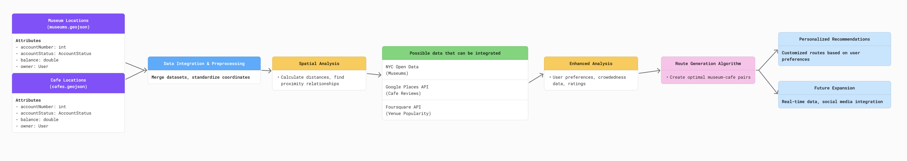

# Dataset and Workflow Explanation

## My Dataset (GeoJSON)

- **Filename**: `Museum.geojson` `Cafe.geojson`
- **Description**:  
  A dataset consisting of cultural hubs in New York and nearby cafes ideal for continuing creative productivity. Research suggests that architectural features such as high ceilings and spacious interiors can significantly enhance creativity, cognitive flexibility, and abstract thinking ([Meyers-Levy & Zhu, 2007](https://www.researchgate.net/publication/23547371_The_Influence_of_Ceiling_Height_The_Effect_of_Priming_on_the_Type_of_Processing_That_People_Use)). Each location is categorized as either a museum or cafe, with cafes selected based on their suitability for work environments that foster creativity.

- **Data Type**: Point data
- **Coordinate System**: WGS84 (EPSG:4326)

**Attribute Information**:

- `name`: Location name  
- `type`: Museum or cafe  
- `description`: Location description  
- `work_friendly`: Work suitability rating (cafes only)

---

## Related Datasets (Additional Connected Data)

- **Primary Dataset**: [NYC Open Data - Museums](https://data.cityofnewyork.us/Recreation/Museums-and-Galleries/sat5-adpb)
- **Secondary Dataset**: [Yelp - NYC Cafe Reviews](https://www.yelp.com/search?cflt=cafes&find_loc=New+York%2C+NY)

**Description**:  
Utilizing official museum information from NYC Open Data and cafe review data from Yelp to analyze cafe environmental characteristics (quietness, Wi-Fi availability, etc.). Review data can be crawled using web scraping to comprehensively enrich cafe attribute information.

---

## Proposed Methodology (Analysis Framework)

As illustrated in the diagram above, the following analytical methodology is proposed:

### 1\. Spatial Accessibility Analysis

Analyze distances between museums (The Shed) and surrounding cafes to generate optimal cafe recommendation routes accessible by walking or cycling.

- **Buffer Analysis**: Identify cafes within 1km radius of museums
- **Network Analysis**: Calculate shortest paths considering actual road networks and walking paths

### 2\. Personalized Recommendation Algorithm

Analyze qualitative data from Yelp reviews (quietness, Wi-Fi, etc.) to recommend cafes based on users' personal preferences (noise sensitivity, required facilities).

- **Natural Language Processing (NLP)**: Extract cafe characteristics through sentiment and keyword analysis from review texts
- **User Preference Matching**: Match extracted characteristics with user profiles to optimize cafe recommendations

### 3\. Real-Time Crowdedness Data

Using [BestTime API](https://besttime.app/) or Google Maps Popular Times data to recommend less crowded cafes during specific time periods, maximizing users' creativity and concentration.

- **Temporal Analysis**: Analyze crowdedness patterns by hourly data
- **Dynamic Recommendation**: Adjust recommendations dynamically based on real-time crowd data

---

## Technical Implementation

### Data Processing Pipeline

- **Data Collection**: Load and validate GeoJSON files
- **Geocoding**: Convert address information to precise coordinates
- **Spatial Join**: Generate distance matrix between museums and cafes
- **API Integration**: Connect and retrieve data from external sources (Yelp Fusion, BestTime API)
- **Machine Learning**: Train recommendation models and make predictions

### Tools and Technologies (For Future Spatial Analysis and Visualization)

- **GeoJSON creation and basic editing**: [geojson.io](https://geojson.io)
- **Advanced Spatial Analysis (optional next step)**: QGIS, PostGIS
- **Programming for further data enrichment and analysis**: Python (GeoPandas, Scikit-learn)
- **Potential Data Sources and API integration**: Google Maps API, Yelp Fusion API, BestTime API
- **Interactive Web-based Visualization**: Leaflet, Mapbox

---

## Advanced Expansion Ideas

- **Wearable Device Integration**: Personalized experiences using smartwatch biometric data (stress level, heart rate variability)
- **Machine Learning Recommendations**: Long-term personalized recommendation system development by accumulating user experience data
- **Augmented Reality (AR)**: Connecting museum experiences to cafes through AR, providing immersive creative environments
- **Social Network Integration**: Trend analysis using social media check-in data
- **Environmental Sensing**: Real-time monitoring of noise levels, temperature, and lighting using IoT sensors for optimal cafe recommendations

---

## Expected Outcomes

### Short-term Goals

- Implement optimal cafe recommendation system following museum visits
- Improve recommendation accuracy and user satisfaction through iterative feedback

### Long-term Vision

- Develop an integrated digital platform connecting cultural facilities and creative workspaces throughout New York City
- Apply spatial network analysis techniques for creative community formation
- Develop cultural accessibility indicators for urban planning, potentially creating a **Creativity Index** to evaluate urban spaces for their potential to support creativity and innovation

---

